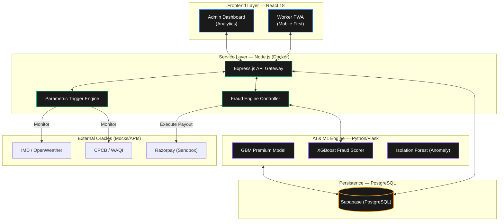

# GigCare — AI-Powered Parametric Insurance

**Built for Guidewire DEVTrails 2026**

GigCare is a specialized parametric insurance platform designed to protect India's gig delivery workforce from income loss caused by uncontrollable external disruptions.

---

## Problem Statement

India’s platform-based delivery partners (Zomato, Swiggy, Zepto, etc.) are the backbone of the digital economy but face a critical vulnerability: **uncontrollable external disruptions**.
- **Income Loss**: Extreme weather, severe pollution (AQI), and unplanned social disruptions cause gig workers to lose 20–30% of their monthly earnings.
- **The Gap**: Currently, no safety net exists to protect these workers from lost hours. They bear the full financial burden of events they cannot control.
- **Constraint**: Traditional insurance is too slow, too complex, and usually focused on health or vehicles, leaving daily wage protection unaddressed.

## Our Solution

GigCare provides a **zero-touch, AI-enabled safety net** that insures the **Income**, not the asset.

- **Parametric Triggers**: Claims are initiated automatically when environmental (Rain, Heat, AQI) or social thresholds are breached, using real-time data from IMD and CPCB.
- **Weekly Pricing Model**: Premiums are structured on a weekly basis (e.g., ₹80–₹250/week) to align with the typical payout cycles of gig workers.
- **AI-Powered Underwriting**: Uses **Gradient Boosting (GBM)** to dynamically adjust weekly premiums based on hyper-local risk factors and predictive weather modeling.
- **Intelligent Fraud Detection**: Combines **XGBoost** scoring with **Isolation Forest** anomaly detection to prevent GPS spoofing and duplicate claims.
- **Instant Payouts**: Automated verification leads to near-instant wallet credits for lost wages, ensuring workers can sustain their livelihoods during disruptions.

---

## System Architecture

GigCare follows a strict layered architecture to ensure reliability, transparency, and rapid automated response.



*Diagram Legend: Solid borders represent LIVE services; components are grouped by infrastructure layer.*


## System Overview

### Core flow

1. A worker signs in and buys a weekly policy.
2. Premium pricing is calculated from zone risk and weather inputs.
3. When conditions cross the configured thresholds, the trigger engine creates a claim.
4. The claim is evaluated by the fraud layer using worker history, location consistency, device/IP linkage, and timing signals.
5. Approved claims are paid out automatically; partial or flagged claims are held for review.

### Key metrics

- 3 coverage tiers: SEED, STANDARD, PREMIUM.
- 5 operational zones.
- 3 main environmental trigger types plus social disruption triggers.
- Automated trust score for claim screening.

## Key Features

- Weekly policy coverage instead of long insurance contracts.
- Automatic claims from trigger events with no manual paperwork.
- Live weather and AQI awareness.
- Admin-triggered demo path that can target a real active policy zone.
- Fraud hardening with reputation, identity linkage, and payout controls.
- Clear worker and admin dashboards that make the system easy to present in a hackathon.

## Fraud Detection

The fraud system is designed to catch claims that do not match normal worker behavior.

It checks for:

- repeated claims from the same trigger event
- unusual claim velocity in short windows
- device or IP reuse across multiple workers
- claims inconsistent with location history
- suspicious timing patterns across zones or cities
- high historical risk scores from previous outcomes

How it responds:
- clean claims can be approved quickly
- medium-risk claims can be partially paid or flagged (using **Isolation Forest** anomaly detection)
- high-risk claims can be denied or escalated
- daily payout caps prevent overpayment in a single day

## Premium Model

The premium service is trained on synthetic and historical samples that mirror weather, zone risk, and payout behavior. It uses a **Gradient Boosting (GB) model** to produce realistic weekly pricing during the demo while still using live weather inputs at runtime. The model is used to differentiate zones so that higher-risk areas receive higher premiums than lower-risk areas.

### Hybrid Location Fallback

If a detected worker location is outside the currently supported 10-city map bounds, GigCare falls back to the nearest supported city and still returns a premium quote. The fallback quote uses nearest-city baseline pricing plus risk and seasonal guard parameters, so onboarding does not fail for edge locations.

---

## Tech Stack

| Layer | Component | Technology | Purpose |
| :--- | :--- | :--- | :--- |
| **Frontend** | Worker App | React, CSS3 | High-performance PWA for worker onboarding and policy management. |
| **Frontend** | Admin Dashboard | React, Tailwind CSS | Real-time monitoring, trigger control, and fraud ring analysis. |
| **Backend** | API Gateway | Node.js (Express) | Main entry point handling Auth (JWT), routing, and orchestration. |
| **Backend** | Trigger Engine | Node.js (Scheduler) | Real-time monitoring of parametric triggers (Weather/AQI/Platform). |
| **AI / ML** | Risk & Pricing | Python (Scikit-Learn) | Gradient Boosting (GBM) model for localized weekly premium calculation. |
| **AI / ML** | Fraud Scoring | Python (XGBoost) | Trust-based scoring evaluating behavioral and geospatial features. |
| **AI / ML** | Anomaly Detection| Python (Scikit-Learn) | Isolation Forest model to detect claims that deviate from worker norms. |
| **AI / ML** | Network Mapper | Python (NetworkX) | Graph analysis to identify and block multi-account fraud rings. |
| **Database** | Primary Store | PostgreSQL | ACID-compliant storage for users, policies, triggers, and claims (Supabase). |
| **Infrastructure** | Orchestration | Docker | Standardized container orchestration across all microservices. |

---

## Project Structure

```
gigcare_phase2_build/
├── .github/
│   └── workflows/
│       └── ci.yml                                # CI/CD pipeline configuration
├── .githooks/
│   └── pre-commit                                # Local git hooks for code quality
├── apps/
│   ├── admin/
│   │   ├── public/
│   │   │   └── index.html                        # Admin app HTML template
│   │   ├── src/
│   │   │   ├── pages/                            # Admin dashboard and login screens
│   │   │   │   ├── AdminLogin.jsx                # Admin authentication page
│   │   │   │   ├── Dashboard.jsx                 # Fleet and claim metrics dashboard
│   │   │   │   └── TriggerPanel.jsx              # Manual event trigger interface
│   │   │   ├── services/
│   │   │   │   └── api.js                        # Admin-specific API integration
│   │   │   ├── utils/
│   │   │   │   └── auth.js                       # Auth state management helpers
│   │   │   ├── App.js                            # Main Admin application component
│   │   │   ├── index.css                         # Global admin styles
│   │   │   └── index.js                          # Admin React entry point
│   │   ├── .dockerignore                         # Admin Docker ignore rules
│   │   ├── Dockerfile                            # Admin container configuration
│   │   ├── package-lock.json                     # Admin dependency lockfile
│   │   ├── package.json                          # Admin dependencies and scripts
│   │   ├── postcss.config.js                     # PostCSS configuration
│   │   └── tailwind.config.js                    # Tailwind CSS design tokens
│   └── worker/
│       ├── public/
│       │   └── index.html                        # Worker app HTML template
│       ├── src/
│       │   ├── pages/                            # Worker onboarding and policy screens
│       │   │   ├── ClaimDetail.jsx               # Individual claim status view
│       │   │   ├── Home.jsx                      # Worker landing and coverage summary
│       │   │   ├── PoliciesList.jsx              # Active and past policies list
│       │   │   ├── PolicyPurchase.jsx            # Weekly policy selection and buy
│       │   │   ├── Register.jsx                  # Worker onboarding flow
│       │   │   └── Splash.jsx                    # App loading/branding screen
│       │   ├── services/
│       │   │   └── api.js                        # Worker-specific API integration
│       │   ├── utils/
│       │   │   └── auth.js                       # Worker auth state helpers
│       │   ├── App.js                            # Main Worker application component
│       │   ├── index.css                         # Global worker styles
│       │   └── index.js                          # Worker React entry point
│       ├── .dockerignore                         # Worker Docker ignore rules
│       ├── Dockerfile                            # Worker container configuration
│       ├── package-lock.json                     # Worker dependency lockfile
│       ├── package.json                          # Worker dependencies and scripts
│       ├── postcss.config.js                     # PostCSS configuration
│       └── tailwind.config.js                    # Tailwind CSS design tokens
├── database/
│   ├── migrations/                               # SQL schema migrations
│   │   └── 001_initial_schema.sql                # Core tables for users, policies, and claims
│   └── seeds/                                    # Default startup data
│       └── seed.sql                              # Initial city and zone configuration
├── services/
│   ├── api/
│   │   ├── config/
│   │   │   └── cities.js                         # Metadata for supported operational zones
│   │   ├── middleware/
│   │   │   └── auth.js                           # JWT validation and role-based access control
│   │   ├── models/
│   │   │   └── db.js                             # High-level data access layer and queries
│   │   ├── routes/
│   │   │   ├── admin.js                          # Admin ops and manual event overrides
│   │   │   ├── auth.js                           # User registration and login logic
│   │   │   ├── claims.js                         # Claim history and manual filing logic
│   │   │   ├── policies.js                       # Policy purchase and activation lifecycle
│   │   │   ├── premiums.js                       # Interface for ML premium calculation
│   │   │   ├── webhooks.js                       # Payment gateway (Razorpay) webhook handling
│   │   │   └── zones.js                          # Geospatial zone lookups and status
│   │   ├── .dockerignore                         # API Docker ignore rules
│   │   ├── Dockerfile                            # API container configuration
│   │   ├── package-lock.json                     # API dependency lockfile
│   │   ├── package.json                          # API dependencies and scripts
│   │   └── server.js                             # Main Express.js API entry point
│   ├── ml/
│   │   ├── fraud_service/
│   │   │   ├── app.py                            # Fraud scoring microservice (Flask)
│   │   │   ├── Dockerfile                        # Fraud service container config
│   │   │   ├── fraud_models.pkl                  # Trained ML model for fraud scoring
│   │   │   ├── fraud_training_data.csv           # Synthetic training data
│   │   │   ├── graph_engine.py                   # NetworkX graph-based ring detection
│   │   │   ├── nlp_trust_enhancer.py             # Sentiment analysis for worker notes
│   │   │   ├── requirements.txt                  # Python dependencies for fraud service
│   │   │   ├── train_fraud.py                    # XGBoost model training logic
│   │   │   └── trust_calculator.py               # Logic for consolidating fraud signals
│   │   └── premium_service/
│   │       ├── app.py                            # Premium calculation microservice (Flask)
│   │       ├── build_real_dataset.py             # Weather data collection for training
│   │       ├── Dockerfile                        # Premium service container config
│   │       ├── premium_model.pkl                 # Trained ML model for pricing
│   │       ├── requirements.txt                  # Python dependencies for premium service
│   │       └── train.py                          # Gradient Boosting model training logic
│   └── trigger-engine/
│       ├── config/
│       │   └── cities.js                         # Shared zone and city configurations
│       ├── models/
│       │   ├── db.js                             # Postgres connection helpers
│       │   └── supabase.js                       # Supabase client initialization
│       ├── sources/                              # Data adapters for real-time parametric triggers
│       │   ├── cpcb.js                           # AQI monitoring via CPCB API
│       │   ├── imd.js                            # Weather monitoring via IMD API
│       │   ├── openmeteo.js                      # Global weather fallback
│       │   ├── openweather.js                    # Secondary weather data source
│       │   ├── social.js                         # Mocked social disruption events
│       │   └── waqi.js                           # Global AQI fallback
│       ├── utils/
│       │   └── geogrid.js                        # Resolution of Lat/Lon to specific city zones
│       ├── claim-dispatcher.js                   # Automated filing of verified claims
│       ├── Dockerfile                            # Trigger engine container configuration
│       ├── evaluator.js                          # Core parametric logic and threshold checks
│       ├── package-lock.json                     # Trigger engine dependency lockfile
│       ├── package.json                          # Trigger engine dependencies
│       └── scheduler.js                          # Main trigger loop (Cron-based)
├── .env.example                                  # Template for environment variables
├── .gitignore                                    # Files and folders ignored by Git
├── docker-compose.yml                            # Multi-container orchestration config
└── README.md                                     # Project overview and documentation (this file)
```

---

## Quick Start

### 1. Prerequisites
Ensure you have [Docker Desktop](https://www.docker.com/products/docker-desktop/) installed and running on your system.

### 2. Launching the Application
```bash
# Clone the repository
git clone https://github.com/Harvey-08/GigCare.git
cd GigCare

# Setup environment variables
cp .env.example .env

# Build and start all services in the background
docker-compose up -d --build
```

### 3. Database Setup (Supabase)
To make the demo work immediately, run these two files in your Supabase SQL Editor:
1.  **[schema.sql](database/schema.sql)**: Run this first to create all tables and enums.
2.  **[seed.sql](database/seed.sql)**: Run this second to populate the demo data.

### 4. Verify Installation
Access the applications once the containers are ready:
- **Worker App**: http://localhost:3010
- **Admin App**: http://localhost:3013
- **API Server**: http://localhost:3011/api
- **API Health**: http://localhost:3011/health
- **ML Services**: Ports 5001 (Premium) & 5002 (Fraud)

> **Note**: Pre-trained ML model files (`.pkl`) are included in the repository. No manual training is required to run the platform.

### Demo credentials
- **Admin Login**: `gigcare@admin.com` / `Admin123@`
- **Worker Login**: Uses the demo worker flow in the app.

---

## Core System Capabilities
- **Battle-Tested Triggers**: 6+ live data connectors (IMD, CPCB, Social).
- **Enterprise Security**: JWT-based auth, role-based access, and encrypted secrets.
- **Production-Ready ML**: Containerized Python services for inference.
- **Scalable Infrastructure**: Fully Dockerized for rapid deployment.

---

## Technical Reference Documents

For the full architecture-aligned specification, algorithms, and real-world API details, please review our comprehensive documentation:

- [**AI Integration & Fraud Pipeline**](docs/AI_INTEGRATION.md): Detailed breakdown of the XGBoost risk engine, Behavioral FRS scoring, and the ML vs. Rules engineering boundary.
- [**Parametric Payout Logic**](docs/PAYOUT_LOGIC.md): Specification of the SEED/STANDARD/PREMIUM tiers and the automated hourly payout formulas.
- [**Parametric Triggers & Data Logic**](docs/PARAMETRIC_TRIGGERS.md): Technical thresholds for IMD/CPCB sensors and the real-time evaluation loop logic.
- [**Engineering Challenges & Solutions**](docs/CHALLENGES.md): Solutions for Basis Risk, GPS Spoofing, and high-concurrency claim spikes.

---


## Future Improvements

- Move trigger and fraud runtime state fully into the database for multi-instance reliability.
- Replace demo payment mode with production payment integration when needed.
- Expand model retraining using real policy and claim history.
- Add broader automated integration tests for trigger, claim, and payout flows.
- Improve region coverage by adding more cities and more live data sources.

---

**Built with ❤️ for India's Gig Delivery Workers**
